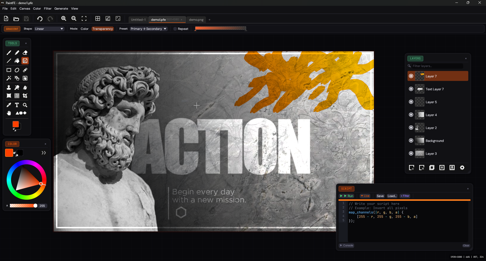

# PaintFE

Free, open-source raster image editor built in Rust. Single portable binary, no installer required.

**[Website](https://paintfe.com)** &nbsp;·&nbsp;
**[Scripting Docs](https://paintfe.com/scripting.html)** &nbsp;·&nbsp;
**[Troubleshooting](https://paintfe.com/troubleshooting.html)**


[](https://github.com/kylejckson/PaintFE/releases/latest)
[](https://scorecard.dev/viewer/?uri=github.com/kylejckson/PaintFE)
[](https://www.bestpractices.dev/projects/12019)

---

23 tools · 25 blend modes · wgpu GPU pipeline · Rhai scripting · CLI batch mode · local AI (BYOM) · GIF/APNG animation · RAW camera support · 15 UI languages · MIT licensed

---



---

## Tools

**Paint** -- Brush, Pencil, Eraser, Line, Fill, Gradient. Brush tip library with variable spacing, soft/hard edges, Dodge/Burn/Sponge modes.

**Select** -- Rect, Ellipse, Lasso, Magic Wand, Move Pixels, Move Selection. Add/Subtract/Intersect modes. Color Range selection via Edit > Select Color Range.

**Warp and Retouch** -- Clone Stamp, Content-Aware Fill, Color Remover, Liquify (WGSL compute shader, CPU fallback), Mesh Warp (Catmull-Rom bicubic spline, GPU displacement pipeline, 2x2 to 6x6 grid), Perspective Crop.

**Utility** -- Color Picker, Text (system fonts), Zoom, Pan, 17 shape primitives.

## Filters and Adjustments

**Adjustments** -- Auto Levels, Desaturate, Invert, Sepia, Brightness/Contrast, Curves, Exposure, HSL, Levels, Color Temperature.

**Filters** -- Gaussian Blur, Box Blur, Motion Blur, Sharpen, Reduce Noise, Median, Pixelate, Unsharp Mask, Emboss, Edge Detect.

**Effects** -- Vignette, Glow, Halftone, Oil Painting, Crystallize, Ink, Perspective, Distort (Bulge/Twist/Wave/Ripple), Noise, Scanlines, Glitch, Drop Shadow, Outline, Contour.

Gaussian Blur, HSL, and Median (at smaller radii) have GPU compute paths. CPU/GPU selection is automatic.

---

## Scripting

Embedded [Rhai](https://rhai.rs/) engine with a sandboxed pixel API and live canvas preview. Scripts run from the built-in editor (View > Script Editor) or via the CLI.

```rhai
apply_desaturate();
apply_brightness_contrast(10.0, 40.0);
apply_vignette(0.5, 0.3);

map_channels(|r, g, b, a| {
    [clamp(r + 15, 0, 255), g, clamp(b - 8, 0, 255), a]
});
```

APIs: Canvas (`width`, `height`, `is_selected`), Pixel (`get/set_pixel`, `for_each_pixel`, `for_region`, `map_channels`), Effect (23 functions), Transform (`flip`, `rotate`, `resize_image`, `resize_canvas`), Utility (`rand_int/float`, `rgb_to_hsl`, `sleep`, `progress`, math). Scripts respect the active selection.

Full reference: [paintfe.com/scripting.html](https://paintfe.com/scripting.html)

---

## CLI Batch Mode

```sh
paintfe -i "shots/*.tif" --script process.rhai --format png --output-dir ./out
paintfe -i photo.png --format jpeg --quality 90 -o out.jpg
```

| Flag | Description |
|------|-------------|
| `-i` / `--input` | Input file or glob pattern (required) |
| `-s` / `--script` | Path to a `.rhai` script |
| `-o` / `--output` | Output file path |
| `--output-dir` | Output directory (for batch jobs) |
| `-f` / `--format` | Output format: `png`, `jpeg`, `webp`, `tiff`, `bmp`, `tga`, `ico` |
| `-q` / `--quality` | JPEG/WebP quality (1-100) |
| `--tiff-compression` | TIFF compression mode |
| `--flatten` | Flatten all layers before export |
| `-v` / `--verbose` | Verbose output |

Exit `0` = all succeeded. Exit `1` = at least one failed (remaining files still process).

---

## AI Background Removal

One AI feature: local background removal via ONNX. No cloud, no API calls, no data leaves the machine.

Supported models (auto-detected): **BiRefNet**, **U2-Net**, **IS-Net (DIS)**.

Setup: Edit > Preferences > AI. Point it at your `onnxruntime.dll` / `libonnxruntime.so` and a model file. ONNX Runtime: [github.com/microsoft/onnxruntime/releases](https://github.com/microsoft/onnxruntime/releases). Model links are in the preferences window.

---

## File Formats

**Read:** PNG, JPEG, WebP, BMP, TIFF, TGA, GIF (animated), APNG (animated), `.PFE`, CR2/CR3/NEF/ARW/DNG/ORF/RW2/SRW/PEF/RAF (RAW via `rawloader`)

**Write:** PNG, JPEG, WebP, BMP, TIFF, TGA, ICO, GIF (static + animated), APNG (animated), `.PFE`

Animated export: each visible layer = one frame. FPS, loop count, and GIF palette are configurable in the export dialog.

---

## Performance Notes

- **Dirty-rect GPU readback** -- only changed pixels read back. A brush stroke at 4K uploads ~6 KB, not ~33 MB.
- **COW tile system** -- `TiledImage` uses `Arc<RgbaImage>` chunks. Canvas clone at 4K costs ~36 KB; undo only stores changed tiles.
- **Tiered undo** -- `PixelPatch` for strokes, `SingleLayerSnapshotCommand` for most filter ops, full snapshot only for canvas-wide ops (resize, flatten).
- **bytemuck zero-copy** -- GPU readback cast to `Color32` with no per-pixel loop.
- **Async readback** -- double-buffered staging (ping-pong) during interactive strokes.
- **rayon** -- compositing, filter cores, and chunk ops are parallelized on the CPU path.

More detail: [performance.html](https://paintfe.com/performance.html).

---

## Localization

15 languages ship built in (View > Language, no restart needed): English, Deutsch, Francais, Espanol, Portugues, Italiano, Russkiy, Polski, Nederlands, Turkce, Nihongo, Simplified/Traditional Chinese, Belarusian, and a Fandom (FE) locale.

To add a language: copy `locales/en.txt`, translate the values (keep key names unchanged), name it with the BCP-47 code (e.g. `ko.txt`), and open a PR.

---

## Building from Source

PaintFE requires a recent stable Rust toolchain (edition 2024).

```sh
# Clone the repository
git clone https://github.com/kylejckson/paintfe
cd paintfe

# Debug build
cargo build

# Release build (optimized, much smaller binary)
cargo build --release

# Run directly
cargo run --release
```

The release binary ends up in `target/release/PaintFE` (Linux) or `target/release/PaintFE.exe` (Windows).

On Windows, `build.rs` uses `winresource` to embed the application icon into the executable. You need the Windows SDK installed for this; it is skipped gracefully on Linux.

**Dependencies (selected)**

| Crate | Purpose |
|-------|---------|
| `eframe` / `egui` 0.24 | Immediate-mode GUI framework |
| `wgpu` 0.20 | GPU rendering via WebGPU API (DX12, Vulkan, Metal) |
| `rayon` 1.7 | CPU parallelism |
| `rhai` 1.24 | Embedded scripting engine |
| `image` 0.24 | Image codec support |
| `rawloader` + `imagepipe` | RAW camera format decoding |
| `arboard` | System clipboard |
| `libloading` | Dynamic ONNX Runtime loading |
| `clap` 4 | CLI argument parsing |
| `bytemuck` | Zero-copy GPU buffer casting |
| `serde` + `bincode` | Project file serialization |

There are no required system dependencies beyond a working GPU driver that supports Vulkan (Linux) or DirectX 12 (Windows). A CPU software fallback is available when no compatible GPU is found.

---

## Contributing

See [CONTRIBUTING.md](CONTRIBUTING.md) for full details on setting up a dev build, code style, commit conventions, and how to submit a pull request or translation.

Bug reports, feature requests, translations, and pull requests are all welcome.

---

## FAQ

**Was AI used to build this?**
Yes. GitHub Copilot was used during development to help with boilerplate and Rust syntax. All generated code was reviewed, tested, and understood before it was committed. The architecture and design decisions were driven by humans. We mention it because it's worth being transparent about.

**Is it really free?**
MIT licensed. No subscription, no account, no telemetry, no feature gates. Use it commercially, fork it, redistribute it.

**Does it work on macOS?**
Yes — macOS builds are available on the releases page. They are unsigned and not notarized, so Gatekeeper will block the first launch. To open it: right-click the app in Finder and choose **Open**, then click **Open** in the dialog. You only need to do this once. After that it opens normally.

**Why is it called PaintFE?**
FE is the periodic table symbol for Iron. It's built in Rust. That's the joke. Call it whatever acronym you want.

---

## License

MIT License. See [LICENSE](LICENSE.md) for details.

```
Copyright (c) PaintFE Contributors

Permission is hereby granted, free of charge, to any person obtaining a copy
of this software and associated documentation files (the "Software"), to deal
in the Software without restriction, including without limitation the rights
to use, copy, modify, merge, publish, distribute, sublicense, and/or sell
copies of the Software, and to permit persons to whom the Software is
furnished to do so, subject to the following conditions:

The above copyright notice and this permission notice shall be included in all
copies or substantial portions of the Software.

THE SOFTWARE IS PROVIDED "AS IS", WITHOUT WARRANTY OF ANY KIND, EXPRESS OR
IMPLIED, INCLUDING BUT NOT LIMITED TO THE WARRANTIES OF MERCHANTABILITY,
FITNESS FOR A PARTICULAR PURPOSE AND NONINFRINGEMENT. IN NO EVENT SHALL THE
AUTHORS OR COPYRIGHT HOLDERS BE LIABLE FOR ANY CLAIM, DAMAGES OR OTHER
LIABILITY, WHETHER IN AN ACTION OF CONTRACT, TORT OR OTHERWISE, ARISING FROM,
OUT OF OR IN CONNECTION WITH THE SOFTWARE OR THE USE OR OTHER DEALINGS IN THE
SOFTWARE.
```

---

*Built in Rust. Free forever. Made by Kyle and contributors.*
