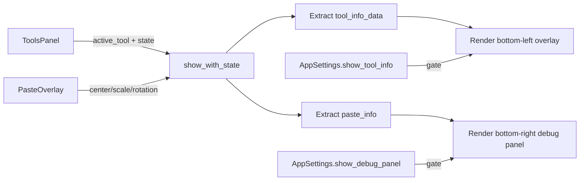

# Tool Info Overlay — Plan

## Overview

Add a context-sensitive info overlay at the **bottom-left** of the canvas area that shows live measurements for specific tools. This mirrors the existing debug panel (bottom-right) but is dedicated to tool-specific metrics rather than general debug info.

## Current Architecture

The existing debug panel lives in [`src/canvas/view/core.rs`](src/canvas/view/core.rs:2367) inside `show_with_state()`. It:
- Is gated by `debug_settings.show_debug_panel`
- Renders at `canvas_rect.right_bottom()` (bottom-right)
- Shows paste info, selection drag dims, or general canvas/zoom/FPS info
- Uses `ui.painter()` (direct painting, not egui UI layout)

The data sources available:
- **Line tool**: [`LineToolState`](src/ui/panels/tools/state.rs:269) — `control_points[0]` (start) and `control_points[3]` (end), `stage` (Idle/Dragging/Editing)
- **Selection tools**: [`SelectionToolState`](src/ui/panels/tools/state.rs:518) — `drag_start`, `drag_end`, `dragging`
- **Shape tool**: [`ShapesToolState`](src/ui/panels/tools/state.rs:1723) — `draw_start`, `draw_end`, `is_drawing`; plus [`PlacedShape`](src/ops/shapes.rs:154) — `cx`, `cy`, `hw`, `hh`, `rotation`
- **Paste overlay**: [`PasteOverlay`](src/ops/clipboard.rs:704) — `center`, `scale_x`, `scale_y`, `rotation`, source dimensions
- **MovePixels**: Same `PasteOverlay` path (extracted selection becomes a paste overlay)

## Changes Required

### 1. Add `show_tool_info` setting

**File**: [`src/config/settings.rs`](src/config/settings.rs:60)

Add a new field to `AppSettings`:
```rust
pub show_tool_info: bool,  // default: true
```

### 2. Extract tool info data in canvas view

**File**: [`src/canvas/view/core.rs`](src/canvas/view/core.rs:1342)

In the "EXTRACT DEBUG INFO" section (around line 1342), add extraction of tool-specific info data. This runs before `tools` is consumed by the rendering path.

Data to extract:

| Tool | Condition | Data |
|------|-----------|------|
| Line | `stage == Dragging \|\| stage == Editing` | Start point, end point, computed length |
| Rect/Ellipse Select | `selection_state.dragging` | Width, height, position |
| Shapes | `is_drawing \|\| placed.is_some()` | Width, height, center position, rotation |
| Paste/MovePixels | `paste_overlay.is_some()` | Already extracted as `paste_info` |

Create a new struct or tuple for this data, e.g.:
```rust
struct ToolInfoData {
    tool_name: &'static str,
    lines: Vec<String>,  // each line rendered separately
}
```

### 3. Render the tool info overlay

**File**: [`src/canvas/view/core.rs`](src/canvas/view/core.rs:2367)

After the existing debug panel block (or inside the same `if debug_settings.show_debug_panel` block), add a new rendering section positioned at **bottom-left** of the canvas.

Positioning:
```
canvas_rect.left_bottom() + Vec2::new(10.0, -10.0)
```

Rendering style (matching the debug panel):
- Semi-transparent black background (`Color32::from_black_alpha(120)`)
- Monospace font, 9pt
- Multiple lines stacked vertically
- 2px corner radius

The info should only show when a relevant tool is active AND has data to display. If no tool is active or no data, render nothing (not even an empty box).

### 4. Wire up the setting toggle

**File**: [`src/ui/panels/settings_window.rs`](src/ui/panels/settings_window.rs:529)

Add a checkbox in the "Debug Info" section:
```rust
ui.checkbox(&mut settings.show_tool_info, t!("settings.general.show_tool_info"));
```

Add the i18n string to [`locales/`](locales/) files.

## Detailed Implementation Steps

### Step 1: Add `show_tool_info` to AppSettings

In [`src/config/settings.rs`](src/config/settings.rs:60), add:
```rust
pub show_tool_info: bool,
```
Default to `true` in the `Default` impl.

### Step 2: Extract tool info data

In [`src/canvas/view/core.rs`](src/canvas/view/core.rs:1342), after the existing `paste_info` and `sel_drag_info` extraction, add:

```rust
// Tool info data (for bottom-left info overlay)
let tool_info_data: Option<Vec<String>> = tools.as_ref().map(|t| {
    let mut lines = Vec::new();
    match t.active_tool {
        Tool::Line => {
            let lt = &t.line_state.line_tool;
            if lt.stage == LineStage::Dragging || lt.stage == LineStage::Editing {
                let p0 = lt.control_points[0];
                let p3 = lt.control_points[3];
                let dx = p3.x - p0.x;
                let dy = p3.y - p0.y;
                let length = (dx * dx + dy * dy).sqrt();
                lines.push(format!("Line: {:.1}px", length));
                lines.push(format!("Pos: ({:.0}, {:.0}) - ({:.0}, {:.0})", p0.x, p0.y, p3.x, p3.y));
            }
        }
        Tool::RectangleSelect | Tool::EllipseSelect => {
            if t.selection_state.dragging {
                if let (Some(s), Some(e)) = (t.selection_state.drag_start, t.selection_state.drag_end) {
                    let w = (e.x - s.x).abs();
                    let h = (e.y - s.y).abs();
                    let cx = (s.x + e.x) / 2.0;
                    let cy = (s.y + e.y) / 2.0;
                    let tool_label = if t.active_tool == Tool::RectangleSelect { "Rect" } else { "Ellipse" };
                    lines.push(format!("{}: {:.0}x{:.0}", tool_label, w, h));
                    lines.push(format!("Center: ({:.0}, {:.0})", cx, cy));
                }
            }
        }
        Tool::Shapes => {
            let ss = &t.shapes_state;
            if ss.is_drawing {
                if let (Some(start), Some(end)) = (ss.draw_start, ss.draw_end) {
                    let w = (end[0] - start[0]).abs();
                    let h = (end[1] - start[1]).abs();
                    let cx = (start[0] + end[0]) / 2.0;
                    let cy = (start[1] + end[1]) / 2.0;
                    lines.push(format!("Shape: {:.0}x{:.0}", w, h));
                    lines.push(format!("Center: ({:.0}, {:.0})", cx, cy));
                }
            } else if let Some(ref placed) = ss.placed {
                let w = placed.hw * 2.0;
                let h = placed.hh * 2.0;
                lines.push(format!("Shape: {:.0}x{:.0}", w, h));
                lines.push(format!("Center: ({:.0}, {:.0})", placed.cx, placed.cy));
                if placed.rotation != 0.0 {
                    lines.push(format!("Rot: {:.1}deg", placed.rotation.to_degrees()));
                }
            }
        }
        _ => {}
    }
    if lines.is_empty() { None } else { Some(lines) }
}).flatten();
```

### Step 3: Render the overlay

In [`src/canvas/view/core.rs`](src/canvas/view/core.rs:2367), inside the `if debug_settings.show_debug_panel` block, after the existing debug panel rendering, add:

```rust
// ====================================================================
// TOOL INFO OVERLAY  (bottom-left, context-sensitive)
// ====================================================================
if debug_settings.show_tool_info {
    if let Some(ref info_lines) = tool_info_data {
        let font_id = egui::FontId::monospace(9.0);
        let text_color = Color32::from_gray(200);
        
        // Layout each line and compute total size
        let mut total_height = 0.0_f32;
        let mut max_width = 0.0_f32;
        let mut galleys = Vec::with_capacity(info_lines.len());
        for line in info_lines {
            let galley = ui.painter().layout_no_wrap(line.clone(), font_id.clone(), text_color);
            max_width = max_width.max(galley.size().x);
            total_height += galley.size().y;
            galleys.push(galley);
        }
        
        // Position at bottom-left
        let info_pos = canvas_rect.left_bottom()
            + Vec2::new(10.0, -(total_height + 10.0));
        let info_rect = egui::Align2::LEFT_TOP.anchor_rect(
            egui::Rect::from_min_size(info_pos, egui::vec2(max_width, total_height))
        );
        
        // Draw background
        painter.rect_filled(info_rect.expand(4.0), 2.0, Color32::from_black_alpha(120));
        
        // Draw each line
        let mut y_offset = info_pos.y;
        for galley in &galleys {
            painter.galley(egui::pos2(info_pos.x, y_offset), galley.clone(), egui::Color32::TRANSPARENT);
            y_offset += galley.size().y;
        }
    }
}
```

### Step 4: Add setting checkbox

In [`src/ui/panels/settings_window.rs`](src/ui/panels/settings_window.rs:529), add after the `show_debug_panel` checkbox:
```rust
ui.checkbox(&mut settings.show_tool_info, t!("settings.general.show_tool_info"));
```

### Step 5: Add i18n string

In the locale files (e.g., `locales/en.txt`), add:
```
settings.general.show_tool_info = Show Tool Info
```

## Data Flow Diagram



## Files Modified

| File | Change |
|------|--------|
| `src/config/settings.rs` | Add `show_tool_info` field |
| `src/canvas/view/core.rs` | Extract tool info data + render overlay |
| `src/ui/panels/settings_window.rs` | Add checkbox toggle |
| `locales/en.txt` (and other locales) | Add i18n string |
